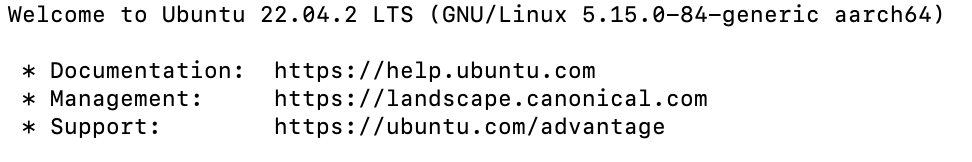

> # How to Connect MacOS to Ubuntu Terminal

## To Connect a Linux OS to a MacOS
Connecting a Linux terminal to a Mac terminal is similar to ssh'ing into a virtual machine.

From my experience on this, ild be showing the steps to how I achieved connecting my Ubuntu terminal to my MacOS

> ### Lets Begin

- The vm(/ubuntu) should be running
- note down the user name and i.p address of the ubuntu machine.

- go to the home directory, using the command

```
cd
```
next use this command

``` 
ssh-copy-id -i ~/ .ssh/id_rsa.pub (vm username)@(vm ip address)
```
the command runs, next input

```
ssh (vm username)@vm ip address
```
enter `ubuntu password`, the terminal displays a message as this:



to log out enter `exit`

to log back in enter `ssh vm username@vm ip address`

and re-enter vm password.


